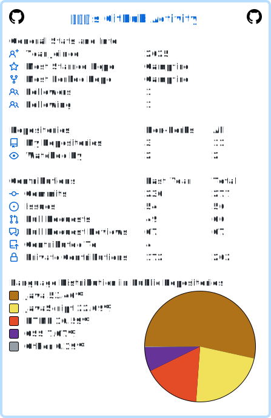

<!-- Header: Capsule Render — tokyo-night palette -->

  

<!-- Typing SVG — tokyo-night blue accent -->

  

<!-- Social — unified tokyo-night labelColor #1a1b27, accent on logo -->

  
  
  
  

---

## 🙋‍♂️ About Me

> **서비스의 구조를 이해하고, 필요한 기능을 끝까지 구현하는 백엔드 개발자입니다.**

- 🧩 **Commerce · Logistics · Healthcare · Community** 도메인에서 백엔드 기능을 설계·구현해 왔습니다.
- ⚙️ 단일 서비스부터 **MSA / Kafka 기반 분산 트랜잭션(Saga, Outbox)** 까지 폭넓게 다뤄봤습니다.
- 🔐 인증·인가(JWT, **WebAuthn/Passkey**), **Rate Limiting**, **Circuit Breaker** 등 API Gateway 운영 경험.
- 🧱 협업 과정에서 **유지보수성·확장성**을 항상 고려합니다.

---

## 🛠 Tech Stack

<!-- All badges share labelColor=1a1b27 (tokyo-night bg) for unified palette -->

### 💻 Language & Framework

  
  
  
  
  
  
  

### 🧬 MSA · Messaging · Resilience

  
  
  
  
  
  

### 🗄 Database & Cache

  
  
  
  

### 📈 Logging & Monitoring (ELK)

  
  
  
  

### ⚙️ DevOps & Tools

  
  
  
  
  
  
  

### 🔐 Auth

  
  

---

## 💼 Projects

### [🛍 high-tension](https://github.com/GoodNyong/high-tension) · 2025.11 ~ 12 · C2C Commerce
> **C2C 온라인 쇼핑 플랫폼 (MSA · Saga/Outbox 기반)** — 담당: **User Service, API Gateway**
- 🔑 JWT(Access 1h + Refresh 7d) + **WebAuthn/Passkey(FIDO2)**, Refresh Token Rotation, Redis 블랙리스트
- 🚪 Gateway: **Token Bucket Rate Limiting (Redis Lua, 원자성 보장)**, **Resilience4j Circuit Breaker**, Eureka 라우팅, Slowloris 방어
- 🧭 Gateway 전용 에러 코드 체계(9000~) 및 WebFlux GlobalExceptionHandler

  
  
  
  
  
  
  
  
  
  
  
  

---

### [🍽 mealhub](https://github.com/GoodNyong/mealhub) · 2025.09 ~ 10 · Food Delivery
> **음식 주문 플랫폼** — 담당: **Order Domain**
- 📦 주문 상태 머신: `PENDING → IN_PROGRESS → OUT_FOR_DELIVERY → DELIVERED` 전이 규칙 검증, 변경 이력 로깅
- 🛡 권한 기반 접근 — 고객/사장님/관리자에 따라 조회 범위 분리
- 🧾 Soft Delete, 가격 재계산 검증, 페이징/정렬 안정성 보장

  
  
  
  
  
  
  
  
  

---

### [📦 one-for-logis](https://github.com/GoodNyong/one-for-logis) · 2025.10 ~ 11 · Smart Logistics
> **MSA 기반 B2B 통합 물류 플랫폼 (9 services)** — 담당: **Notification Service (Slack · Gemini AI)**
- 🤖 **Gemini API 자연어 분석**으로 도착 기한·허브 정보 기반 **최적 출발시한 자동 산출**
- 🔔 **Kafka 이벤트 기반 알림** (주문 생성 / 배송 상태 변경 구독) — 멱등성 보장
- 🛡 **Resilience4j Circuit Breaker + FeignClient Fallback**으로 외부 API 장애 격리

  
  
  
  
  
  
  
  
  

---

### [🏃 Blinkos](https://github.com/GoodNyong/Blinkos) · Health Management
> **건강 관리 웹 애플리케이션** — 회원·건강 기록·커뮤니티·관리자
- 🛡 Spring Security 4.2 기반 인증/인가, 이메일 인증 + reCAPTCHA, 비밀번호 정책
- 🧹 **레거시 코드 품질 개선** — SLF4j 전환(29개소), try-with-resources, StringBuilder, 중복 제거
- 📤 파일 업로드, JavaMail, CKEditor 연동

  
  
  
  
  
  
  
  

---

### [🔥 Campfire](https://github.com/GoodNyong/Campfire) · Game Community
> **JSP/Servlet 기반 게임 커뮤니티 웹 애플리케이션**
- 📰 **YouTube · Naver News API** 주기적 수집(스케줄러)으로 메인 콘텐츠 큐레이션
- 📋 게시판/댓글 CRUD, 리뷰·게임 관리, 회원/관리자 페이지
- 🔒 SQL 인젝션 제거(PreparedStatement), DAO 리소스 누수 정리, 드라이버 최신화

  
  
  
  
  
  
  

---

## 📊 GitHub Stats

  

  

---

## 🐍 Contribution Snake

  

---

## 📫 Contact

  
  
  
  

<!-- Footer Capsule Render — same gradient as header, mirrored -->

  

